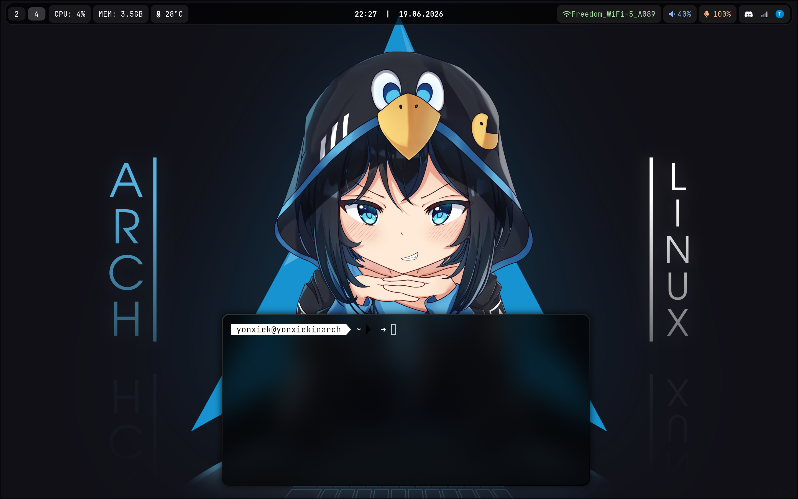

# dots4hypr | by yonxiek

Мой минималистичный чёрно-белый сетап для **Hyprland**. Основная идея — ничего лишнего, только продуктивность и чистый вид.

---

## Что внутри?

| Компонент | Выбор |
| :--- | :--- |
| **OS** | Linux (Arch based) |
| **WM** | [Hyprland](https://hyprland.org/) |
| **Bar** | [Waybar](https://github.com/Alexays/Waybar) |
| **Shell** | Zsh + Oh My Zsh |
| **Terminal** | Foot / Kitty |
| **Font** | JetBrainsMono Nerd Font |

---

## Скриншот

> *Панель Waybar с блюром и монохромный терминал.*

---

## Особенности

- **Waybar**: 
  - Компактные воркспейсы слева.
  - Мониторинг CPU и MEM в текстовом виде.
  - Дата и время строго по центру.
  - Раздельное управление звуком и микрофоном.
  - Текстовый индикатор Wi-Fi (вместо иконок в трее).
- **Zsh**: 
  - Кастомная монохромная тема `Black & White`.
  - Индикатор статуса последней команды (➜).
  - Отображение текущей Git-ветки.

---

## Установка

Если ты хочешь установить доты себе:

# Скопируй репозиторий на свой диск:
git clone https://github.com/yonxiek/dotsidk.git
cd dotsidk
Запусти скрипт для установки:
sh install.sh
# Также можешь установить пакеты, которые использовались мною:
sudo pacman -S --needed < packages.txt
yay -S --needed < aur_packages.txt
